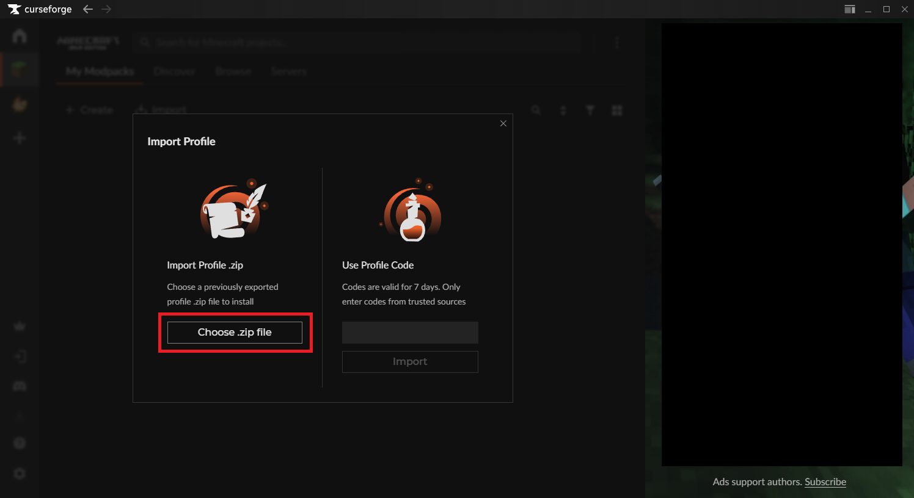

 

---

### Overview

Lilac is a Minecraft 1.12.2 Tech Modpack.

---

### Highlights

**Mods**

Tech

- Applied Energistics 2

- Computer Craft: Tweaked
* Draconic Evolution

* Extreme Reactors

* EnderIO

* Environmental Tech

* Galacticraft

* Industrial Foregoing

* Thermal Dynamics

* Mekanism [Slightly nerfed version]

Dimensions

- Aether

- Galacticraft

- Mining Dimension (Aroma1997's Dimensional World)

- Twilight Forest

Misc.

* Chisel

* Ender Storage

* Fossils and Archeology: Revival

* Iron Chests

* Lucky Blocks

* OpenBlocks

* Simple Voice Chat

* Tinkers' Construct

**Quests**

Lilac features a very simple, non-extensive Quest system to help introduce new players to Modded concepts and specific mods in this pack.

**Server**

I will be hosting a private server running this modpack instance for an undefined amount of time. Feel free to join!

Message Creeper if you need the IP or have issues joining.

---

### Minimum Requirements

6 GB Deditated Ram

---

### How to Download

* Go to the Releases page of this Repo
  
  * https://github.com/Creeper798/Lilac/releases

* Find the latest release, and Left-Click the .zip file under "Assets" to download it

---

### How to Install

* Download the CurseForge Desktop App.
  
  * https://www.curseforge.com/download/app

* On the Minecraft page, Click "My Modpacks" and then "Import"
  
  

* Click "Choose .zip file"

* Select the .zip file you downloaded from the Releases page.

Once the Modpack finishes downloading, you should be able to launch it by clicking "Play" on the instance.

---

### Optional

You can increase the amount of deditated RAM by Right-Clicking the instance and selecting "Profile Options".
